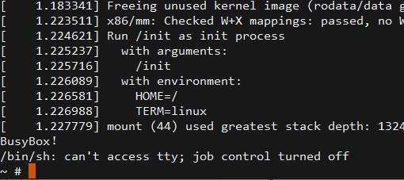
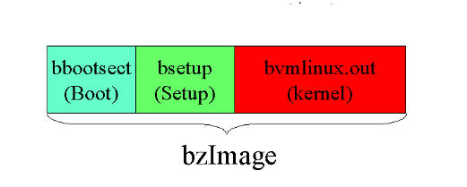

Writing a Virtual Machine Manager
========

Recently I decided to learn eBPF, and during this process I encountered [Firecracker](https://firecracker-microvm.github.io/), a virtual machine manager. I never reached eBPF: I took a wrong direction and fell down to the rabbit hole of virtualization instead. Before this, my mental image of a VMM had been an enormous system such as QEMU or VMware, but Firecracker convinced me that a virtual machine manager does not need to be complicated at all. Therefore I decided to construct one myself.

The final result was a successful Linux kernel boot, which reached a BusyBox shell:



The code is available on [GitHub](https://github.com/mistivia/mvvmm), and the rest of this post explains it.

## Creating the Virtual Machine

This step consists only of a few `ioctl` calls to the KVM interfaces, all inside the `vm_guest_init` function. There is little to explain here; it is entirely routine code:

- `KVM_CREATE_VM`: create the virtual machine
- `KVM_CREATE_IRQCHIP`: create the interrupt chip emulator
- `KVM_CREATE_PIT2`: create the timer chip emulator
- `KVM_SET_USER_MEMORY_REGION`: load the memory allocated with `mmap`
- `KVM_CREATE_VCPU`: create the virtual CPU

## CPU Initialization

Here we arrive at the first decision. Our goal is to load and boot a Linux kernel, and because of x86's well-known historical complications, a 64-bit Linux kernel has three separate entry points — one for 16-bit mode, one for 32-bit mode, and one for 64-bit mode. We must choose one of them.

Booting from the 16-bit entry point would require emulating a BIOS, which is tedious even to imagine. Starting from the 64-bit entry point would require placing the CPU into 64-bit mode ourselves, and 64-bit mode on x86 requires paging, so we would also have to determine the memory mapping and construct page tables.

The 32-bit boot is considerably simpler in comparison: no BIOS and no page tables. Our kernel is 64-bit, but the kernel itself manages paging and the transition into 64-bit mode, so this is not our responsibility. Our purpose is to write a virtual machine manager, not a bootloader or an operating system, which makes the 32-bit entry point the natural choice.

According to the kernel's boot protocol, the CPU must be in 32-bit "flat mode" before we jump to the 32-bit entry point. In flat mode the CPU is 32-bit but paging is disabled, so every address maps directly to physical memory.

On real hardware, reaching this mode requires a famously complicated initialization sequence — the [OSDev Wiki](https://wiki.osdev.org/GDT_Tutorial) provides the details. This too is merely x86 historical legacy and not worth the effort here. With the interfaces that KVM provides, it reduces to setting the internal state of the segment registers and the `cr0` control register, after which the virtual CPU enters 32-bit flat mode:

```c
void set_flat_mode(struct kvm_segment *seg) {
    seg->base = 0;
    seg->limit = 0xffffffff;
    seg->g = 1;
    seg->db = 1;
}

struct kvm_sregs sregs;
ioctl(cpu_fd, KVM_GET_SREGS, &sregs);
set_flat_mode(&sregs.cs);
set_flat_mode(&sregs.ds);
set_flat_mode(&sregs.es);
set_flat_mode(&sregs.fs);
set_flat_mode(&sregs.gs);
set_flat_mode(&sregs.ss);
sregs.cr0 |= 0x1;
ioctl(cpu_fd, KVM_SET_SREGS, &sregs);
```

Finally, `rip` must point at 0x100000, where the kernel entry point will be loaded and where the CPU will begin execution, and `rsi` must point at 0x10000, where the kernel boot parameters will be loaded:

```c
struct kvm_regs regs;
ioctl(cpu_fd, KVM_GET_REGS, &regs);
regs.rip = 0x100000;
regs.rsi = 0x10000;
ioctl(cpu_fd, KVM_SET_REGS, &regs);
```

Both of these addresses come from the Linux kernel boot protocol; the next section explains why they have these values.

The final step is CPUID: we ask the KVM API which CPUID entries it supports and pass them directly to the virtual CPU:

```c
struct kvm_cpuid2 *cpuid;
int max_entries = 100;
cpuid = malloc(sizeof(*cpuid) +
    max_entries * sizeof(struct kvm_cpuid_entry2));
cpuid->nent = max_entries;
ioctl(kvm_fd, KVM_GET_SUPPORTED_CPUID, cpuid)
ioctl(cpu_fd, KVM_SET_CPUID2, cpuid)
```

The CPU is now initialized. The only element still missing is the kernel.

## Loading the Kernel

To load the kernel we first need to understand how the kernel file is organized. The format in which a modern Linux kernel is distributed is called bzImage. Traditionally, each 512-byte segment of a disk is called a sector, and the first sector of the kernel image is the boot sector, used when booting from 16-bit mode. After it follow several sectors of boot parameters (setup), and only then does the actual kernel begin:



The boot sector is only for 16-bit boot, so we can ignore it and consider only the other two parts. The boot protocol describes precisely what loading the kernel involves:

- Prepare the boot parameters (`boot_params`, traditionally called the "zero page")
- Copy the setup header, which begins at offset 0x01f1 in the kernel image, into `boot_params` and verify it
- Complete the remaining `boot_params` fields
- Point the `%esi` register at `boot_params`

We begin by mapping the bzImage into memory:

```c
bz_image = map_file(kernel_path, &bz_image_size);
```

In the previous section we pointed `%rsi` at 0x10000, so this is where `struct boot_params` will reside. We place it there and set it to zero:

```c
zeropage = (struct boot_params *)(vm->memory + 0x10000);
memset(zeropage, 0, sizeof(*zeropage));
```

Then we copy the setup header from offset 0x01f1:

```c
memcpy(&zeropage->hdr, bz_image+0x01f1, sizeof(zeropage->hdr));
```

The command-line arguments also require a free location in memory; I chose 0x20000. We have no VGA display, only a serial port, so the arguments instruct the kernel to print to the serial console and to enable debug output:

```c
#define KERNEL_ARGS "console=ttyS0 debug"
cmd_line = (char *)(vm->memory + 0x20000);
memcpy(cmd_line, KERNEL_ARGS, strlen(KERNEL_ARGS) + 1);
```

We may also want an initial RAM disk (initrd). The kernel is not strict about where the initrd resides — any location is acceptable, provided we indicate that location. I placed mine at the 512 MB position, in the `load_initrd` function:

```c
uint32_t initrd_addr = 0x20000000;
memcpy(vm->memory + initrd_addr, initrd, st.st_size);
```

Then we complete the kernel's boot parameters. First, the location of the command-line arguments:

```c
zeropage->hdr.cmd_line_ptr = 0x20000;
```

The video mode field receives the default value 0xFFFF:

```c
zeropage->hdr.vid_mode = 0xFFFF;
```

There is no bootloader here — we are emulating the loading process ourselves — so the bootloader field may contain any value:

```c
zeropage->hdr.type_of_loader = 0xFF;
```

The location of the RAM disk:

```c
zeropage->hdr.ramdisk_image = initrd_addr;
zeropage->hdr.ramdisk_size = st.st_size;
```

And a flag that informs the kernel we are loading it at the 1 MB position:

```c
zeropage->hdr.loadflags |= LOADED_HIGH;
```

The most delicate step is the memory layout. I marked two regions as usable memory: 0–640 KB and 1 MB–1 GB. Why there must be a gap between 640 KB and 1 MB, I do not know; all I discovered is that an incorrect value can cause a kernel panic. This is more x86 historical residue, and I have chosen not to investigate further.

```c
zeropage->e820_entries = 2;
// first 640KB
zeropage->e820_table[0].addr = 0;
zeropage->e820_table[0].size = 0xA0000;
zeropage->e820_table[0].type = 1;
// > 1MB
zeropage->e820_table[1].addr = 0x100000;
zeropage->e820_table[1].size = MEM_SIZE - 0x100000;
zeropage->e820_table[1].type = 1;
```

Finally we copy the kernel portion of the bzImage to the 1 MB position. To determine where that portion begins, we need the combined size of the boot and setup parts: boot is a fixed 512 bytes, and the setup size is stored in the setup header we just copied, measured in 512-byte sectors. This gives us the kernel's offset:

```c
setup_size = (zeropage->hdr.setup_sects + 1) * 512;
memcpy(vm->memory + 0x100000,
       (char *)bz_image + setup_size,
       bz_image_size - setup_size);
```

And with this, the kernel is loaded.

## Serial Port Emulation

Until a network device emulator exists, the serial port is our only means of interacting with the virtual machine: it prints the kernel's debug output, and it can host a shell. There is not much to this section, however. I did not want to read the hardware manual, so I asked Kimi to generate a serial port emulator that is adequate for our purpose. It can only write, never read — no input whatsoever — but at this stage that is sufficient.

The serial code is located in the `serial_init` and `handle_serial` functions. Note that the emulator's initialization must occur at the moment we create the virtual machine.

## Running the Virtual CPU

This section concerns mainly the `vm_run` function.

Before we can run the virtual CPU, we must map a small region of memory located behind the virtual CPU's file descriptor; `KVM_GET_VCPU_MMAP_SIZE` tells us its size. Through this region KVM later provides us with the details of IO and MMIO exits:

```c
mmap_size = ioctl(vm->kvm_fd, KVM_GET_VCPU_MMAP_SIZE, 0);
run = mmap(NULL, mmap_size, PROT_READ | PROT_WRITE,
           MAP_SHARED, vm->cpu_fd, 0);
```

Once the mapping is complete, we can run the virtual CPU through the `KVM_RUN` interface:

```c
ioctl(vm->cpu_fd, KVM_RUN, 0)
```

The CPU then runs until it returns control to us, for one of several reasons:

- The virtual machine has shut down
- The virtual machine has requested IO
- The virtual machine has requested memory-mapped IO (MMIO)

MMIO is indispensable for modern block and network devices, but we do not need any of that yet, so we ignore it entirely. On a shutdown request, we simply terminate.

IO requests here refer to x86's [IO ports](https://wiki.osdev.org/I/O_Ports). Most of them we can ignore completely, but the serial port's requests we must handle. The details reside in the memory we mapped earlier: we examine the port number, and if it lies between 0x3f8 and 0x3ff it belongs to the serial port, so we pass it to `handle_serial`:

```c
if (run->io.port >= 0x3f8 && run->io.port <= 0x3ff) {
    handle_serial(vm, run);
}
```

## Creating the BusyBox RAM Disk

First, install BusyBox:

```bash
sudo pacman -S busybox
```

Create a rootfs directory:

```bash
mkdir rootfs
```

Then the directories we cannot omit:

```bash
cd rootfs
mkdir dev sys proc bin
```

Install BusyBox into it:

```bash
busybox --install bin/
```

Write an init script:

```bash
#!/bin/sh

mount -t devtmpfs devtmpfs /dev
mount -t proc proc /proc
mount -t sysfs sys /sys
mdev -s

echo "BusyBox!"
/bin/sh -l

while : ; do
    sleep 1
done
```

Make it executable, then package the entire directory into a cpio image:

```bash
chmod +x init
find . -print0 | cpio --null -ov --format=newc | gzip > ../initrd
```

And this gives us our initial RAM disk: the initrd file.

## Wrapping Up

At this point we can start the virtual machine. First, obtain a kernel from the host machine:

```bash
cp /boot/vmlinuz-linux ./vmlinuz
```

The filename varies from one distribution to another, but it is always similar to this.

Then compile the virtual machine manager:

```bash
gcc small_vmm.c -o small_vmm
```

And run it:

```bash
sudo ./small_vmm vmlinuz initrd
```

If everything proceeds correctly, you will obtain the BusyBox shell prompt shown in the screenshot at the beginning. Typing into it will have no effect, however — the serial emulation is incomplete and has no input path — so the only available action is to press Ctrl+C to exit.

## Summary

This brings our virtual machine manager to a reasonable stopping point. As for the next steps, the first evident task is completing the serial emulation so that we can actually type at the console, which probably requires reading the manual and whatever other material I can find about the 8250 chip.

After that comes the emulation of virtio devices, which requires working from [this specification](https://docs.oasis-open.org/virtio/virtio/v1.0/virtio-v1.0.html). A complete implementation must emulate the PCI bus, but Linux offers a command-line parameter for providing the kernel with a virtio device's MMIO address directly, without any PCI bus, which reduces the work dramatically.

And then there is multiprocessor support, another substantial amount of work in addition to all this.

In its current state, this virtual machine manager is of course useless. But it is not far from being genuinely useful, either. With the addition of block and network device emulation, it would be adequate for deploying backend applications that require environment isolation — running an application such as clawdbot would be entirely feasible.

If application development, frontend work, and CRUD backends form the popular curriculum, then the lower levels of computing form the hidden one. None of it is genuinely difficult; it is merely specialized, so much of the knowledge is transmitted through personal communication and through careful reading of source code — sometimes even the most capable AI cannot provide an adequate answer. Virtualization is a relatively mainstream technology, yet when one examines the details it becomes hidden once again. This is what motivated me to write this post.

## References

- [The Linux/x86 Boot Protocol](https://www.kernel.org/doc/html/v6.1/x86/boot.html)
- [The Definitive KVM API Documentation](https://docs.kernel.org/virt/kvm/api.html)
- [Linux Kernel Boot](https://wdv4758h.github.io/notes/blog/linux-kernel-boot.html)
- [用Rust实现极简VMM - Ihcblog!](https://www.ihcblog.com/rust-mini-vmm-1/)
- [The kernel's command-line parameters](https://docs.kernel.org/admin-guide/kernel-parameters.html)
- [kvm_host.c - GitHub Gist](https://gist.github.com/zserge/ae9098a75b2b83a1299d19b79b5fe488)
- [vmm-reference - GitHub](https://github.com/rust-vmm/vmm-reference/)
