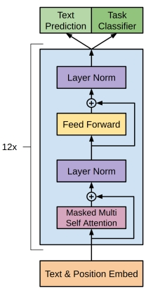

Computing Multi-Head Attention
========

Multi-Head Attention is the cornerstone of transformer-based large language models. Yet its computation is difficult to visualize intuitively, because the matrices are rearranged in a confusing manner. Therefore I wrote this post to examine it in detail.

Abstract letters such as $a, b, c$ only increase the mental effort, so whenever a matrix dimension appears here, I will provide a unique prime number instead — concrete numbers are easier to follow. Since all the dimensional numbers are unique, you do not need to interpret them as literal sizes; you can simply treat each one as a distinct label.

## A Linear Algebra Refresher

When we say an $a \times b$ matrix, we mean a matrix with $a$ rows and $b$ columns. You can consider this matrix as composed of $a$ row vectors, or equivalently $b$ column vectors.

Multiplying an $a \times b$ matrix $A$ by a $b \times c$ matrix $B$ produces an $a \times c$ matrix $R$. The element $R_{xy}$, at row $x$ and column $y$, is the inner product of the $x$-th row vector of $A$ and the $y$-th column vector of $B$.

## From Input to Output

Let us begin by examining the input and output. Suppose the input consists of 3 tokens, and each token, after the addition of positional encoding, is "embedded" into a 5-dimensional vector. So the input here is a $3 \times 5$ matrix, which we will call $X$. Each token is a row vector, written as $X_1, X_2, X_3$.

The output must have the same size as the input — also a $3 \times 5$ matrix, which we will call $Y$. Each row of $Y$ is written as $Y_1, Y_2, Y_3$.

## Q, K, V

Let us begin with $Q$ and $K$.

Suppose that for each token, $Q$ and $K$ are both 7-dimensional vectors; then for 3 tokens, $Q$ and $K$ are $3 \times 7$ matrices. To obtain $Q$ and $K$, we define parameter matrices $W_Q$ and $W_K$, both $5 \times 7$. Then we perform the matrix multiplication:

$$
\begin{aligned}
Q &= X W_Q \\
K &= X W_K
\end{aligned}
$$

If we transpose $K$ and multiply $Q$ by it, then $Q K^T$ is a $3 \times 7$ matrix multiplied by a $7 \times 3$ matrix, which produces a $3 \times 3$ matrix.

We scale this matrix by dividing every entry by $\sqrt{7}$, then apply a causal mask, which converts the upper triangle into negative infinity. To understand what a causal mask does, here is an example: suppose we have a $3 \times 3$ matrix:

$$
\begin{pmatrix}
1 & 2 & 3 \\
4 & 5 & 6 \\
7 & 8 & 9
\end{pmatrix}
$$

After applying the causal mask, it becomes:

$$
\begin{pmatrix}
1 & -\infty & -\infty \\
4 & 5 & -\infty \\
7 & 8 & 9
\end{pmatrix}
$$

Then we apply $\operatorname{softmax}$ to each row; the negative infinities become 0, and the result is a $3 \times 3$ matrix whose upper triangle is entirely zero. We call this $S$:

$$ S = \operatorname{softmax}\left(\frac{Q K^T}{\sqrt{7}}\right) $$

If you are not familiar with the softmax operation, for the moment simply consider it as a kind of normalization: it maps every number between $-\infty$ and $+\infty$ into the range 0 to 1, while ensuring that all the numbers in a row sum to 1.

Finally, suppose that for each token, $V$ is an 11-dimensional vector. Then $W_V$ must be a $5 \times 11$ matrix. From:

$$ V = X W_V $$

we obtain that $V$ is a $3 \times 11$ matrix.

Multiplying $S$ and $V$ produces:

$$ H = S V $$

$H$ is also a $3 \times 11$ matrix.

## Multi-Head Attention

Suppose we have 2 heads. This means that the $Q, K, V$ above each exist in two versions, as do $W_Q, W_K, W_V$. That is:

$$
\begin{aligned}
Q_1 &= X W_{Q1} \\
K_1 &= X W_{K1} \\
V_1 &= X W_{V1} \\
Q_2 &= X W_{Q2} \\
K_2 &= X W_{K2} \\
V_2 &= X W_{V2}
\end{aligned}
$$

So we also obtain two $H$ matrices: $H_1, H_2$. Both are $3 \times 11$ matrices. Concatenating them produces a $3 \times 22$ matrix:

$$ \operatorname{Concat}(H_1, H_2) $$

## Output

Through multi-head attention, we have obtained a 22-dimensional vector for each input token. But our output must be 5-dimensional, like the input. So we add a $22 \times 5$ parameter matrix $W_O$. Multiplying the $3 \times 22$ matrix by the $22 \times 5$ matrix produces the $3 \times 5$ matrix $Y$:

$$ Y = \operatorname{Concat}(H_1, H_2) W_O $$

## Analyzing the Input-Output Relationship

Suppose we treat the entire algorithm above as a black box, and combine all the weights together as $W$. That is:

$$ W = (W_{Q1}, W_{K1}, W_{V1}, W_{Q2}, W_{K2}, W_{V2}, W_O) $$

Then, analyzing the abstract relationship between input and output row by row, we can write:

$$
\begin{aligned}
Y_1 &= f_1(X_1; W) \\
Y_2 &= f_2(X_1, X_2; W) \\
Y_3 &= f_3(X_1, X_2, X_3; W)
\end{aligned}
$$

Here the functions $f_1, f_2, f_3$ are fixed once the algorithm and hyperparameters are chosen; $W$ contains the trainable weights. Notice that the $N$-th row of the output is determined entirely by the first $N$ rows of the input.

## KV Cache

Suppose that after computing $Y$, we append a 4th row $X_4$ to the input $X$, while $X_1, X_2, X_3$ remain unchanged. By the analysis above, $Y_1, Y_2, Y_3$ also remain unchanged, and we only need to compute $Y_4 = f_4(X_1, X_2, X_3, X_4; W)$.

Notice that in all the intermediate results above, every matrix with 3 rows becomes a matrix with 4 rows, while the first three rows remain exactly the same. So if we cache those first three rows, we only need to compute the fourth row — which saves a great deal of computation. Going further, notice that the 4th row of matrix $H$ has no relation to the first three rows of $Q$, so the contents of $Q$ can be discarded immediately after use. This is precisely how the KV Cache saves computation.

## Closing

To conclude, here is the architecture diagram from the [original GPT paper](https://cdn.openai.com/research-covers/language-unsupervised/language_understanding_paper.pdf):

As you can see, the only genuinely complex part is the multi-head attention discussed in this post. The parts not discussed here — residual connections, layer norm, and the FFN — are all relatively simple, so I will not describe them in detail.
