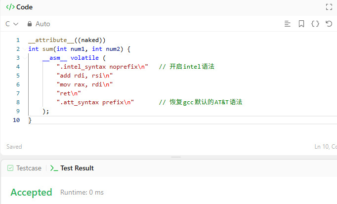

如何用汇编刷算法题
===============

刷算法题是学了新编程语言后练手的绝佳方式。之前写了一篇手写汇编]的内容，但是支持汇编的刷题网站是很少的。

不过好在基本上大部分地方都支持C语言，也用gcc编译器，这样我们就能用inline汇编来实现用汇编刷算法题了。

gcc通常的inline汇编语法大概是这样：

```c
#include <stdio.h>

int main(void)
{
    int a = 10;
    int b = 20;
    int result;

    asm (
        "addl %2, %0"
        : "=r" (result)     // 输出
        : "0" (a), "r" (b)  // 输入
    );

    printf("result = %d\n", result);
    return 0;
}
```

不光用的是晦涩的AT&T语法，后面的一坨`: "=r" (result)`以及`"0" (a), "r" (b)`，意味不明、复杂难记，寄存器也不能自己分配。

所以我更倾向直接用`__attribute__((naked))`汇编，看起来会清爽很多。

这里用Leetcode上最最最简单的一道题为例：[Add Two Integers](https://leetcode.com/problems/add-two-integers/)。

这道题的答案就一行：

```c
int sum(int num1, int num2) {
    return num1 + num2;
}
```

如果用`__attribute__((naked))`汇编的话就是这样：

```c
__attribute__((naked))
int sum(int num1, int num2) {
    __asm__ volatile (
        ".intel_syntax noprefix\n"   // 开启intel语法
        "add rdi, rsi\n"
        "mov rax, rdi\n"
        "ret\n"
        ".att_syntax prefix\n"       // 恢复gcc默认的AT&T语法
    );
}
```

这样看起来就规整不少了。除了首尾一些模板代码，核心部分很简单：

```c
"add rdi, rsi\n"
"mov rax, rdi\n"
"ret\n"
```

然后因为__asm__里面的汇编代码是直接插入到编译结果里面的，所以甚至可以不用管函数边界，直接在函数里面定义汇编函数，比如这样：

```c
int sum(int num1, int num2);

__attribute__((naked))
void impl() {
    __asm__ volatile (
        ".intel_syntax noprefix\n"   // 开启intel语法
        "ret\n"
        "sum:\n"
        "    add rdi, rsi\n"
        "    mov rax, rdi\n"
        "    ret\n"
        ".att_syntax prefix\n"       // 恢复gcc默认的AT&T语法
    );
}
```

唯二的麻烦大概是gcc的inline汇编必须是字符串，要处理C语言的escape，另外也用不了宏。不过这些也很好解决，用AI生成一个Python脚本，读入汇编源代码文件，用C预处理器`cpp`处理好，宏都展开，然后做一下字符串escaping，换行符替换成`\n`，`"`变成`\"`等等，最后填入`__attribute__((naked))`、`__asm__ volatile`，以及`.att_syntax prefix`这些模板。

## 效果展示


